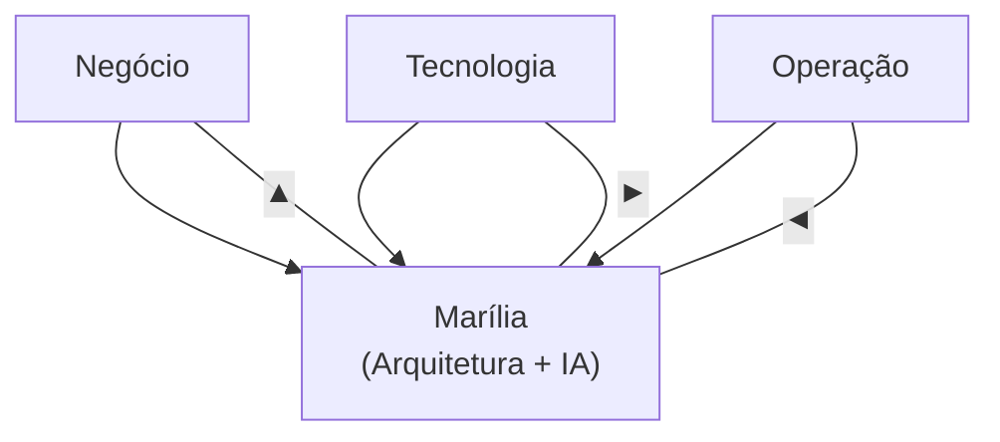

# 👋 Olá, eu sou a Marília, mas pode me chamar de Mar

Sou uma profissional de **Arquitetura de Soluções foco em automação em evolução para Engenharia de IA**, com atuação em automação, integração de sistemas e soluções digitais corporativas.

Faço um pouco de tudo, e isso é intencional.  
Aprendo rápido, sou curiosa, apaixonada por IA e tecnologia, e motivada por desafios que exigem **visão sistêmica, pensamento crítico e execução real**.

Atuo conectando **negócio, tecnologia e operação**, sempre com foco em soluções que funcionam no mundo real.

---

## 🧭 Meu foco hoje

---

## 🛠️ Tecnologias & Ferramentas

### Núcleo Técnico

### IA Aplicada

### Plataformas & Integração

### Linguagens de Apoio

---

## 🚀 Projetos em destaque

### 🔹 Orquestrador de RPA em Python *(público)*
Sistema em Python para **orquestração de execuções de RPAs**, com controle de horários, ambientes, máquinas e logs a partir de uma base centralizada.

- Foco em confiabilidade e controle operacional  
- Pensado para ambientes corporativos reais  

🔗 **Repositório:** _link em breve_

---

### 🔹 Ecossistema Digital de Projetos no SharePoint *(corporativo / restrito)*
Arquitetura de um ecossistema completo para:

- Entrada estruturada de demandas  
- Priorização automatizada  
- Gestão de projetos e tarefas  
- Histórico e rastreabilidade  
- Documentação automatizada  

🔗 **Case arquitetural:** _documentação conceitual em breve_

---

### 🔹 Análise Automatizada de Projetos de Custeio Agrícola e Pecuário *(corporativo / restrito)*
Solução em **UiPath + OCR + Azure Document Intelligence** para:

- Extração inteligente de dados  
- Validação técnica e financeira  
- Encaminhamento automático para crédito ou ajustes  

🔗 **Case técnico:** _descrição de arquitetura em breve_

---

### 🔹 Base de Conhecimento com IA integrada ao Microsoft Teams *(corporativo / restrito)*
Criação de múltiplas bibliotecas de conhecimento organizadas em SharePoint, consumidas por um **agente com LLM**, apoiando busca, entendimento e tomada de decisão.

🔗 **Case de IA aplicada:** _documentação em breve_

---

## 🧠 Como eu penso tecnologia

- Arquitetura vem antes da ferramenta  
- IA é meio, não fim  
- Automação sem processo definido vira dívida  
- Código precisa ser sustentável, não heroico  

---

## 🌱 Em evolução constante

Atualmente aprofundando estudos em:
- Arquitetura de soluções  
- Engenharia de IA aplicada  
- Sistemas de conhecimento corporativo  
- Automação inteligente em escala  

---

## 📫 Onde me encontrar

